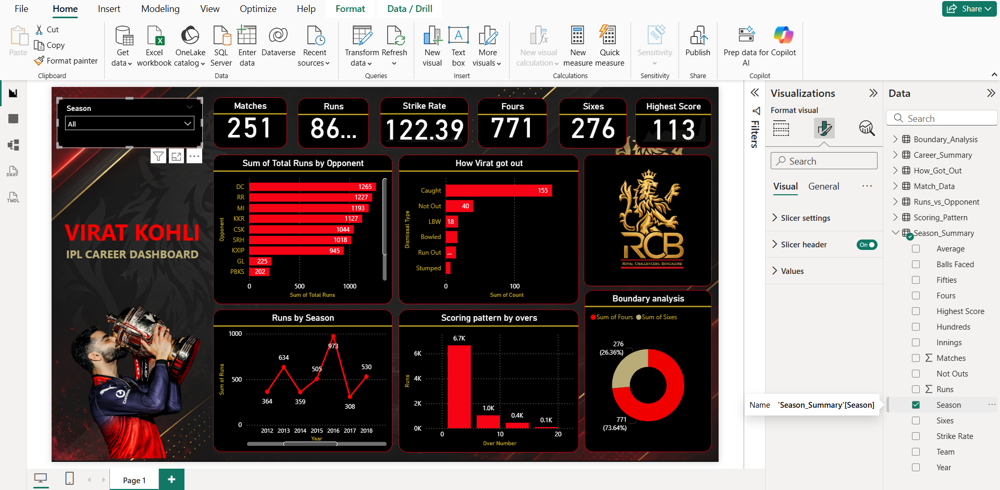

# 🏏 Virat Kohli IPL Career Analytics Dashboard

## 📌 Project Overview

This project presents an interactive Power BI dashboard analyzing Virat Kohli's IPL career performance across multiple seasons. The dashboard provides insights into batting performance, scoring patterns, opponent-wise statistics, boundary analysis, and season-wise trends using data visualization techniques.

The objective of this project is to transform cricket statistics into meaningful business-style insights through interactive dashboards and data storytelling.

---

## 🚀 Features

* Interactive Season Filter
* Career Performance KPI Cards
* Runs by Season Analysis
* Runs Against Different Opponents
* Boundary Analysis (Fours & Sixes)
* Strike Rate Analysis
* Scoring Pattern by Overs
* Highest Score Tracking
* Custom RCB-Themed Dashboard Design
* Dynamic Visual Interactions

---

## 📊 Dashboard Metrics

### Key Performance Indicators (KPIs)

* Total Runs
* Total Matches
* Strike Rate
* Highest Score
* Total Fours
* Total Sixes

### Visualizations

* Runs by Season
* Runs vs Opponent
* Scoring Pattern by Overs
* Boundary Distribution
* Performance Trend Analysis

---

## 🛠️ Tools & Technologies Used

* Power BI Desktop
* DAX (Data Analysis Expressions)
* Microsoft Excel
* Data Modeling
* Data Visualization

---

## 📂 Dataset

The dataset contains Virat Kohli's IPL batting statistics, including:

* Season
* Runs
* Matches
* Strike Rate
* Fours
* Sixes
* Highest Score
* Opponent Statistics
* Over-wise Scoring Analysis

---

## 🎯 Key Insights

* Identified Virat Kohli's highest-performing IPL seasons.
* Analyzed scoring patterns across different phases of an innings.
* Compared performance against various IPL teams.
* Evaluated boundary-hitting trends throughout his IPL career.
* Visualized long-term performance progression through interactive charts.

---

## 📷 Dashboard Preview

---

## 📁 Repository Structure

Virat-Kohli-IPL-Career-Analytics-Dashboard

├── Virat_Kohli_Dashboard.pbix

├── Dataset

│ └── Virat_Kohli_Data.csv

├── Screenshots

│ └── Dashboard.png

└── README.md

---

## 💡 Learning Outcomes

Through this project, I gained hands-on experience in:

* Building interactive Power BI dashboards
* Creating KPI cards and analytical reports
* Data cleaning and transformation
* DAX calculations and measures
* Dashboard design and storytelling
* Sports analytics visualization

---

## 👨‍💻 Author

**Likith H P**

Data Analysis | Power BI | SQL | Python | Data Visualization

## ⭐ If you found this project interesting, consider giving it a star.

